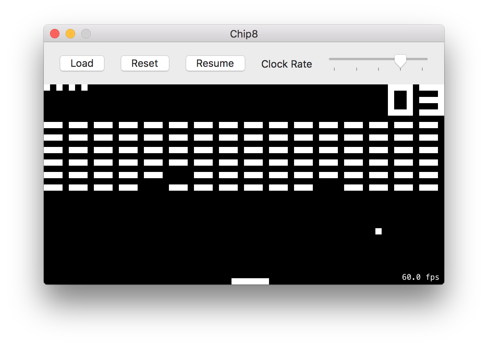

## Chip8
### CHIP-8 Emulator and Disassembler

This project contains an emulator and disassembler for the [CHIP-8 virtual machine](https://en.wikipedia.org/wiki/CHIP-8) written in Swift. Emulation is an area of interest that I hadn't explored much, so I worked on this relatively simple emulator to learn more about it.



### Chip8Kit

`Chip8Kit` is a library that contains a platform independent, pure Swift implementation of a CHIP-8 emulator and disassembler. It can be compiled as an OS X framework from Xcode using `Chip8.xcodeproj`, or it can be compiled as a Swift module using [Swift Package Manager](https://github.com/apple/swift-package-manager) by running `swift build` inside the project root directory.

#### Emulation

```swift
import Chip8Kit

do {
	let rom = try ROM(path: "BRIX")
	let emulator = Emulator(rom: rom)
	
	// Emulate a single clock cycle
	// Typically called at a rate of 500Hz
	let state = try emulator.emulateCycle()
	
	// Emulate a single timer tick for the sound and delay timers
	emulator.emulateTimerTick()
	
	// Pass key events to the emulator.
	emulator.setState(true, forKey: .Num1)
} catch let error {	
	print(error)
}
```

#### Disassembler

```swift
import Chip8Kit

do {
	let rom = try ROM(path: "BRIX")
	
	// Disassemble the ROM and get a list of opcodes
	let opcodes = Disassembler.disassemble(rom)
	
	// ...or pretty print the disassembly
	Disassembler.printDisassembly(rom)
} catch let error {	
	print(error)
}
```

### Chip8

`Chip8.app` is an OS X application (pictured above) that uses `Chip8Kit` to emulate and `SpriteKit` to render the screen. It provides a few simple UI controls for loading ROMs, resetting the emulator, pausing/resuming, and varying the clock rate from 1Hz - 1000Hz.

#### Keypad

The following default key mapping is used (from [here](http://www.multigesture.net/articles/how-to-write-an-emulator-chip-8-interpreter/)):

```
Keypad                   Keyboard
+-+-+-+-+                +-+-+-+-+
|1|2|3|C|                |1|2|3|4|
+-+-+-+-+                +-+-+-+-+
|4|5|6|D|                |Q|W|E|R|
+-+-+-+-+       =>       +-+-+-+-+
|7|8|9|E|                |A|S|D|F|
+-+-+-+-+                +-+-+-+-+
|A|0|B|F|                |Z|X|C|V|
+-+-+-+-+                +-+-+-+-+
```

The key mapping can be customized by setting `Chip8View.keyMapping`.

#### Sound

The CHIP-8 can only play a single sound, which is a beep. I couldn't find an appropriately licensed copy of the original sound, so `Chip8.app` defaults to using the system beep noise in its place. The beep sound can be customized by setting the `Chip8View.beepSound` property.

### Resources

* https://en.wikipedia.org/wiki/CHIP-8
* http://www.multigesture.net/articles/how-to-write-an-emulator-chip-8-interpreter/
* http://devernay.free.fr/hacks/chip8/C8TECH10.HTM


### Contact

* Indragie Karunaratne
* [@indragie](http://twitter.com/indragie)
* [http://indragie.com](http://indragie.com)

### License

`Chip8` is licensed under the MIT License. See `LICENSE.md` for more information.